# PaperLens — Architecture

The one-sentence version: **every cross-cutting concern has exactly one owner, and changing it
there changes it everywhere.**

This document explains what that means concretely — what each folder is for, how a request
flows through it, and where each concern lives. Decisions and their rejected alternatives are
in [`adr/`](adr/README.md); day-to-day rules are in [`CONVENTIONS.md`](CONVENTIONS.md); adding
a feature is [`FEATURE_TEMPLATE.md`](FEATURE_TEMPLATE.md).

---

## Contents

1. [Folder structure](#1-folder-structure)
2. [Dependency graph](#2-dependency-graph)
3. [Data flow](#3-data-flow)
4. [Request lifecycle](#4-request-lifecycle)
5. [Mutation lifecycle](#5-mutation-lifecycle)
6. [Error lifecycle](#6-error-lifecycle)
7. [Auth lifecycle](#7-auth-lifecycle)
8. [State management](#8-state-management)
9. [Dependency injection](#9-dependency-injection)
10. [Configuration](#10-configuration)
11. [Theme](#11-theme)
12. [Security](#12-security)
13. [Logging](#13-logging)
14. [Cache](#14-cache)
15. [Network](#15-network)
16. [Feature module anatomy](#16-feature-module-anatomy)
17. [Scaling to 500 screens](#17-scaling-to-500-screens)

---

## 1. Folder structure

Four top-level concepts, in dependency order. Each may import from the ones below it and never
from the ones above.

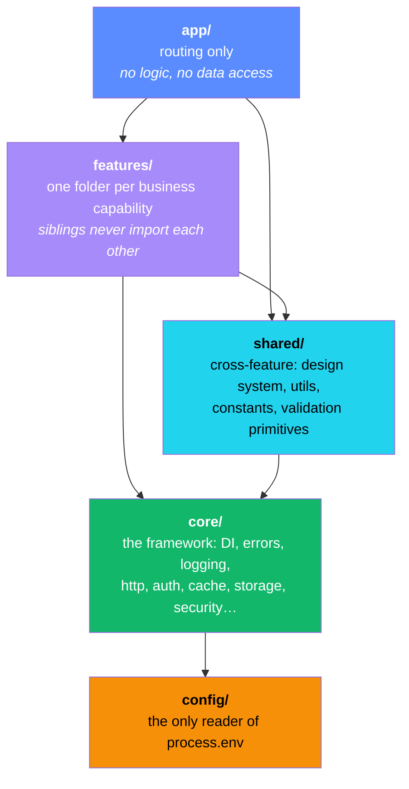

```
src/
├── app/                        ROUTING ONLY. A page reads params, calls a use case,
│   ├── (marketing)/            renders a component. If a file here has an `if` about
│   │   └── page.tsx            business rules, it is in the wrong folder.
│   ├── (app)/                  Authenticated shell: /scan, /document/[id]
│   ├── (auth)/                 /login
│   ├── api/health/             The one route handler
│   ├── layout.tsx              Root layout: fonts, theme script, providers
│   ├── providers.tsx           The single client-provider tree
│   ├── globals.css             Tailwind + @theme mapping
│   ├── tokens.css              EVERY design value, declared once  → ADR 0008
│   ├── error.tsx               Segment boundary (gets `unstable_retry`, not `reset`)
│   ├── global-error.tsx        Root boundary — replaces <html>, so it re-declares theme
│   ├── not-found.tsx  loading.tsx
│   └── unauthorized.tsx  forbidden.tsx     (experimental.authInterrupts)
│
├── proxy.ts                    Next 16's middleware. Optimistic cookie check + headers.
│                               EXPLICITLY NOT AUTHORIZATION — see §7.
├── instrumentation.ts          register() + onRequestError → the server error funnel
├── instrumentation-client.ts   Client error + web-vitals funnel
│
├── config/                     THE ONLY PLACE process.env IS READ. Lint-enforced.
│   ├── env.server.ts             Zod-parsed, `server-only`, fails fast at boot
│   ├── env.client.ts             NEXT_PUBLIC_* only, safe to bundle
│   ├── app.config.ts             Derived, typed application settings
│   ├── runtime.ts                Which runtime am I in (server/client/edge/build)
│   └── tenant.ts                 White-labeling: token + copy overrides  → §17
│
├── core/                       THE FRAMEWORK. Feature-agnostic. Imports nothing from features/.
│   ├── result/                   Result<T,E> — ok/err/map/andThen/unwrapOr    → ADR 0002
│   ├── errors/                   AppError, ERROR_CODES registry, normalizeError,
│   │                             withActionErrors/withRouteErrors, rethrow guard
│   ├── container/                Typed-token DI: register/resolve/override    → ADR 0003
│   ├── logging/                  Logger port, transports, redaction, request context
│   ├── http/                     HttpClient: interceptors, retry, timeout, Zod parsing
│   ├── auth/                     AuthProvider + SessionStore ports, DAL, RBAC policy
│   ├── cache/                    cacheLife profiles, typed tag builders, revalidation
│   ├── storage/                  StorageDriver port: local/session/memory/cookie
│   ├── network/                  Connectivity status port + offline policy
│   ├── security/                 CSP, headers, sanitize, rate-limit port
│   ├── analytics/                AnalyticsProvider port + typed event registry
│   ├── monitoring/               ErrorReporter port (crash reporting)
│   ├── flags/                    FlagProvider port + FLAGS registry
│   ├── i18n/                     Dictionary port, typed t(), plurals, locales
│   └── time/                     Clock port — so "now" is injectable
│
├── shared/                     Cross-feature. May import core/. May NOT import features/.
│   ├── constants/                routes, storage-keys, query-params, http, limits, regex
│   ├── validation/               Zod primitives, parse helpers → Result
│   ├── utils/                    Pure functions only. No I/O, no framework.
│   ├── state/                    createStore() factory (Zustand)              → ADR 0006
│   └── ui/                       THE DESIGN SYSTEM
│       ├── tokens/                 Token *names* (values live in app/tokens.css)
│       ├── theme/                  ThemeProvider + no-flash script            → ADR 0011
│       ├── primitives/             Unstyled behaviour
│       ├── components/             Styled, cva-variant components
│       ├── patterns/               Multi-component compositions
│       ├── toast/  icons/  fonts.ts  cn.ts  tone.ts
│
├── features/                   FEATURE-FIRST MODULES. Siblings NEVER import each other.
│   └── document-analysis/
│       ├── domain/               Entities, value objects, PORTS. Imports nothing.
│       ├── application/          Use cases + DTO mappers. Imports domain only.
│       ├── infrastructure/       Repository + data source impls. Imports domain + core.
│       ├── presentation/         Components + server actions. Imports application.
│       ├── validation/           Feature-specific schemas
│       ├── module.ts             DI registration — the ONLY importer of infrastructure/
│       └── index.ts              Public API — the ONLY legal import path from outside
│
├── server/
│   ├── bootstrap.ts            THE COMPOSITION ROOT. The only file that names adapters.
│   └── actions/                Cross-feature server actions (auth)
│
└── test/
    ├── contracts/              PORT CONTRACT SUITES — one suite per port, run against
    │                           every adapter. This is what makes swapping real.
    ├── fakes.ts  stubs/  setup.ts
```

Every top-level folder has its own `README.md` stating its purpose and import rules.

---

## 2. Dependency graph

The rule, in one line:

```
app → features/*/index → presentation → application → domain ← infrastructure → core → config
```

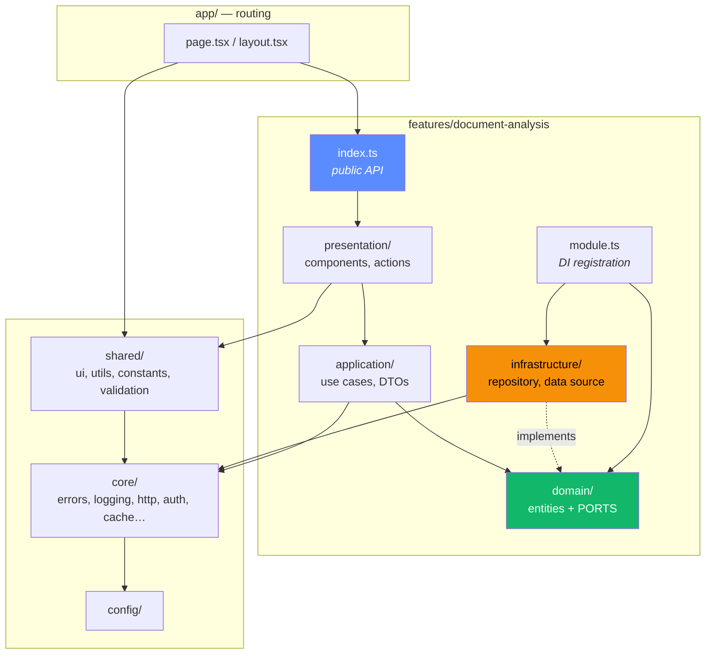

Read the two arrows into `domain/` carefully. `application/` **calls** the port; `infrastructure/`
**implements** it. Both point at `domain`, so `domain` depends on nothing — it is the only
layer that can be reasoned about without knowing anything else exists. This is the dependency
inversion the whole structure is arranged around: the use case says "I need somewhere to save
an analysis", and the database adapter satisfies that requirement rather than defining it.

**Enforced, not documented.** `eslint.config.mjs` uses `no-restricted-imports` zones:

| Rule | Prevents |
|---|---|
| `app/` may not import `features/*/{domain,application,infrastructure,presentation}` | Routes reaching past a feature's public API |
| Any feature importing another feature's internals | The coupling that makes modules un-ownable |
| `domain/` importing anything at all | Business rules depending on a framework |
| Non-`module.ts` importing `infrastructure/` | Call sites binding themselves to an adapter |
| Anything but `config/` reading `process.env` | Configuration scattering |
| `core/` importing `features/` | The framework knowing about its users |
| `dangerouslySetInnerHTML` outside `shared/ui/theme/` | Unaudited HTML injection |

Verify it fires: add `import { x } from '@/features/document-analysis/infrastructure'` to a
page and run `npm run lint`.

---

## 3. Data flow

One direction. UI never touches a data source; a data source never knows what renders it.

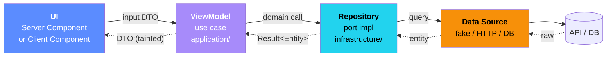

Three rules make this hold:

- **Never skip a layer.** A page importing a repository compiles and works, and is exactly how
  layering dies. The lint zones make it fail instead.
- **Entities stop at the application layer.** What crosses into UI is a **DTO** — a
  deliberately narrower shape. `experimental.taint` marks entities so passing one to a Client
  Component is a runtime error, not a code-review catch.
- **The data path returns `Result`, not exceptions.** A failure is a value the caller must
  handle and the type system can see. Exceptions are for boundaries only (§6).

---

## 4. Request lifecycle

A GET of `/document/[id]`.

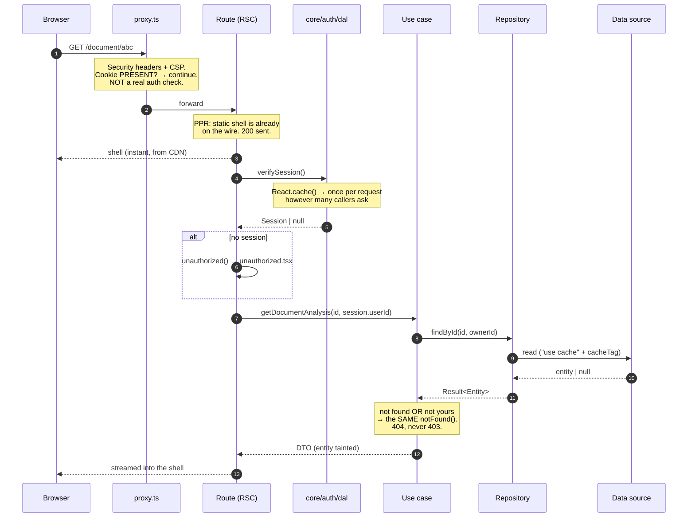

Two consequences worth knowing before writing a test:

- **`notFound()` inside a `<Suspense>` boundary cannot change the status line**, because the
  `200` was sent with the shell. It swaps the UI mid-stream. Assert on what the user receives,
  not on the status code.
- **Ownership failure returns 404, not 403.** A 403 confirms the resource exists, which turns
  the URL into an oracle for what other people have. "Not yours" and "not there" must be
  indistinguishable.

---

## 5. Mutation lifecycle

A document submitted from `/scan`.

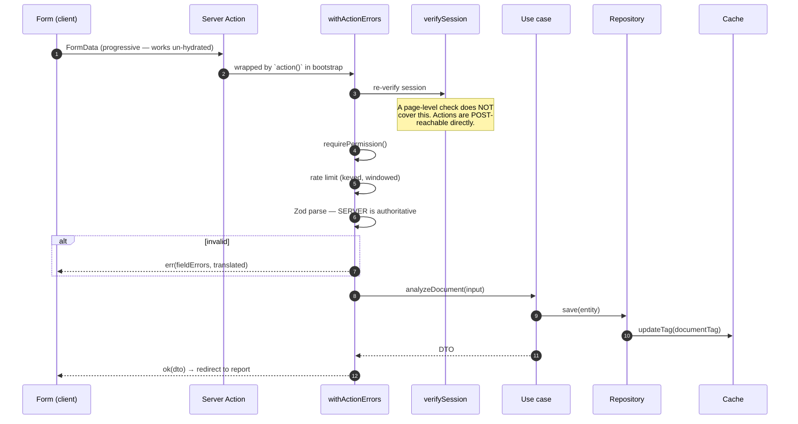

Everything above the use case is applied by **one wrapper**, `action()` in
`server/bootstrap.ts`. No action re-implements any of it, which is what makes "every action is
observed, rate-limited and authorized" a property of the codebase rather than a review habit.

Client-side Zod runs too, for instant feedback. It is an optimisation and nothing more — the
server re-validates identically and its answer is the one that counts.

---

## 6. Error lifecycle

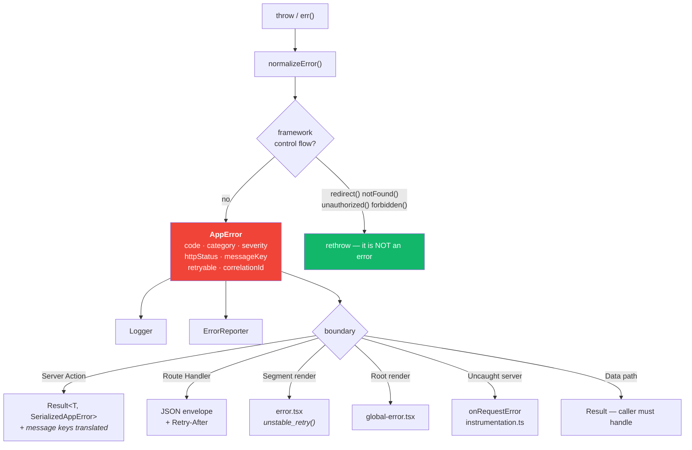

- **Every `catch` starts by rethrowing framework signals.** `normalizeError` does it first
  thing, so using it instead of a bare `catch` makes swallowing a `redirect()` structurally
  impossible. This is lint-enforced.
- **`report` is a property of the error code**, not a call-site decision. A 404 pages nobody;
  a `CONFIGURATION_ERROR` pages someone. Registered once in `ERROR_CODES`.
- **`AppError.toClient()` strips everything an attacker could learn from** — stack, cause,
  internal context — leaving a code, a message *key* and field errors.
- **Message keys are resolved at the action boundary**, the last point still on the server that
  knows the request's locale. A key carries its parameters with it (`validation.tooShort?min=200`)
  because the schema is the only thing that knows the bound and a field error must stay a flat
  serializable string. A raw `validation.document.tooShort` reaching a user is a bug, and an
  E2E test asserts on the English sentence to catch it.

---

## 7. Auth lifecycle

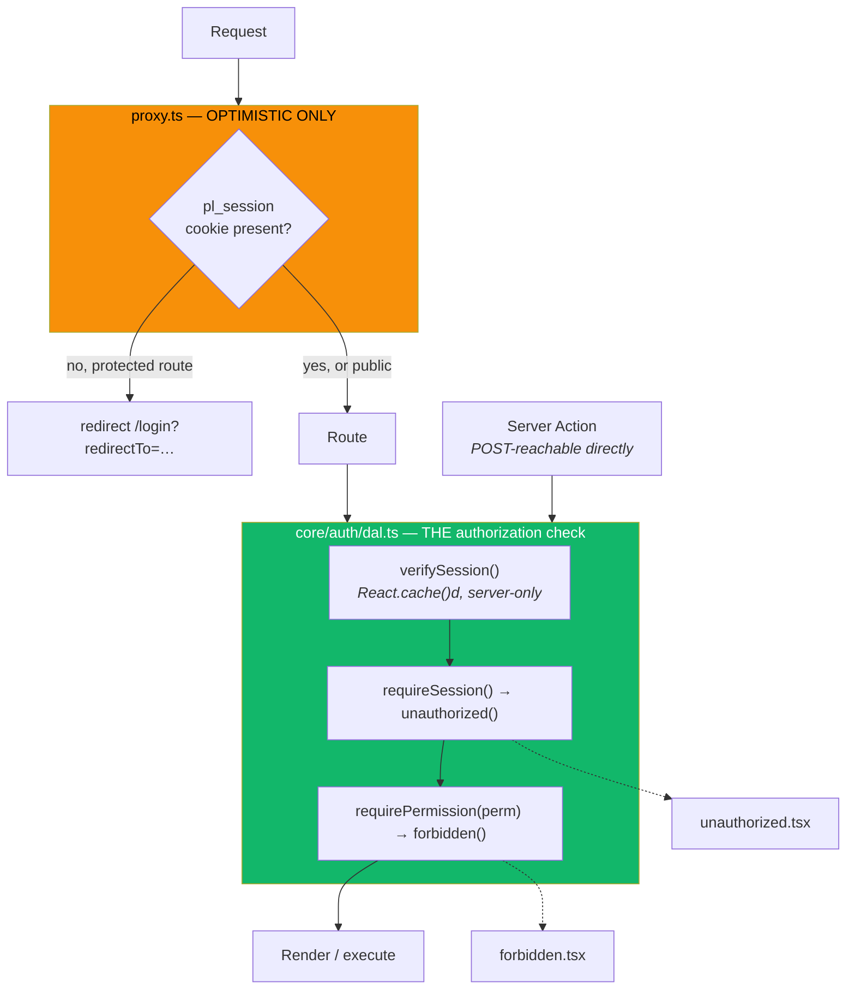

**The proxy is not the authorization layer.** It asks whether a cookie exists, which is a
question a forged cookie answers correctly. It runs on every request including static assets,
so it must stay cheap; and a Server Action can be POSTed without ever passing through a page,
so a page-level check does not cover it.

Authorization is `verifySession()` in the DAL — `server-only`, wrapped in `React.cache()` so
N callers cost one verification per request. Every page and every action calls it.

An E2E test injects a garbage `pl_session` cookie and asserts the request reaches the route
and fails *there*. If it ever passes by being redirected at the proxy, the proxy has become
load-bearing for security and the test is telling you so.

---

## 8. State management

The first question is not "which library" but "is this even client state". In an RSC app,
mostly it is not.

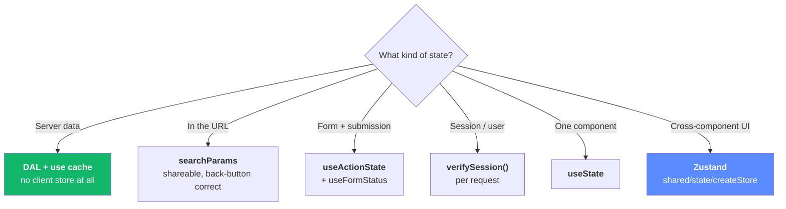

Zustand handles only the last row — theme preference, toasts, drawer/modal state, unsaved
drafts. It is provider-free (so it does not force a Client Component boundary high in the
tree), slice-based, and selector-driven.

Every store is built by `createStore()` in `shared/state`, which owns devtools, persistence
via the injected `StorageDriver` (not raw `localStorage`), `skipHydration`, and a `reset()`
for tests. Full reasoning and the alternatives in [ADR 0006](adr/0006-state-management.md).

---

## 9. Dependency injection

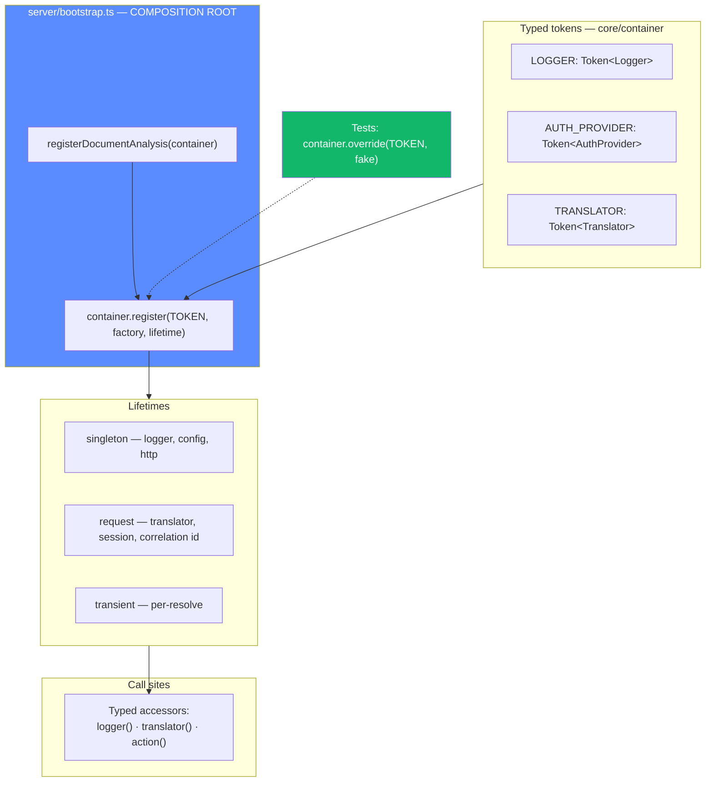

A token is a branded symbol carrying its type, so `resolve(LOGGER)` returns `Logger` with no
casting and no string keys. ~200 lines, no decorators, no `reflect-metadata` — which matters
because decorator transforms fight SWC/Turbopack and never cross the RSC boundary.

Request scope comes from `React.cache()` rather than `AsyncLocalStorage` plumbing: React
already gives one memo slot per request, which is exactly what request scope means.

`action()` resolves its dependencies **per invocation**, not at module load. Every call site is
`export const x = action(…)` at module scope, which runs at import time — long before there is
a request to have a scope. This is the kind of detail that is obvious only after it crashes.

Full reasoning: [ADR 0003](adr/0003-own-di-container.md).

---

## 10. Configuration

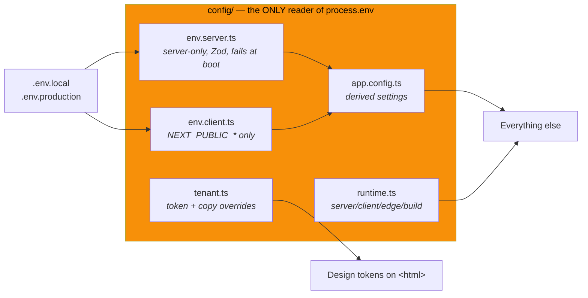

- **Fails at boot, not at 3am.** `env.server.ts` Zod-parses on import. A missing variable
  crashes the process at startup with the variable named, instead of surfacing as `undefined`
  inside a string concatenation on the one code path nobody tested.
- **`server-only` on the server file.** Importing it from a Client Component is a build error,
  not a leaked secret in a JS bundle.
- **One lint rule does the rest.** `process.env` outside `config/` is an error, so there is no
  gradual drift back to reading env vars wherever it is convenient.

---

## 11. Theme

```mermaid
sequenceDiagram
    autonumber
    participant H as HTML &lt;head&gt;
    participant S as Inline blocking script
    participant LS as localStorage
    participant P as First paint
    participant R as React / ThemeProvider

    H->>S: parse (blocking, before paint)
    S->>LS: read pl:theme {v,d}
    Note over S: 3 separate try/catch:<br/>storage · JSON · matchMedia.<br/>Every path ends with a theme.
    S->>S: 'system' → matchMedia(prefers-color-scheme: light)
    S->>H: documentElement.dataset.theme = resolved
    H->>P: paint ONCE, correctly
    P->>R: hydrate
    R->>R: useSyncExternalStore ADOPTS the decision
    Note over R: Provider never re-decides.<br/>It syncs OS changes and<br/>owns writes from here.
```

`app/tokens.css` holds every value; `dark` is the unconditional base and `light` is an override
block (CSS cannot share one declaration between `[data-theme="dark"]` and the
`prefers-color-scheme` media query, so one theme must be the base). `shared/ui/tokens/` mirrors
the token *names* in TypeScript so tenant overrides are type-checked, and a test parses the
stylesheet to prove the two lists never drift.

ADRs [0008](adr/0008-design-tokens-single-source.md) and [0011](adr/0011-theme-ownership.md).

---

## 12. Security

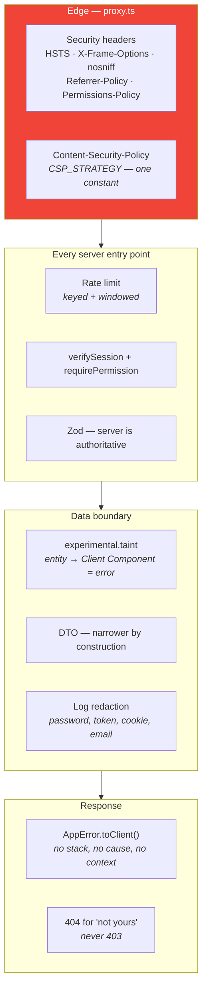

The CSP runs `compatible` (nonce-less) rather than `strict-nonce`, because a nonce forces every
route to render dynamically and destroys the PPR static shell. That trade-off, its residual
risk, and the single constant that reverses it are in
[ADR 0009](adr/0009-csp-strategy.md) — written down deliberately, so nobody later finds
`'unsafe-inline'` in a header dump and assumes it was an oversight.

---

## 13. Logging

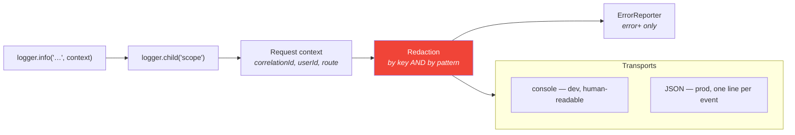

- **Structured, always.** `{level, time, scope, msg, ...context}` — one JSON line per event in
  production, so it is queryable without a parser that guesses at message formats.
- **Redaction is not optional and not per-call-site.** Keys (`password`, `token`, `cookie`,
  `authorization`) and value patterns (emails, bearer tokens, card-shaped numbers) are stripped
  in the pipeline. A call site cannot forget, because it never gets the chance.
- **Correlation id flows automatically** from the request context into every log line and out
  through `HttpClient` headers, so one user-reported failure is one query.

---

## 14. Cache

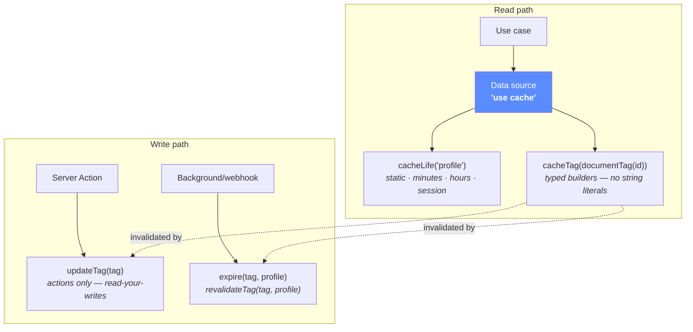

`core/cache` owns the *vocabulary* — profiles, typed tag builders, revalidation helpers — and
never storage. Next's cache is the only cache; a second one beside it would immediately
disagree with it about what is fresh.

Note the Next 16 signatures: `revalidateTag(tag, profile)` takes a second argument, and
`updateTag()` is Server-Actions-only. Details and rejected alternatives (bespoke CacheManager,
TanStack Query, Redis on day one) in [ADR 0004](adr/0004-framework-native-caching.md).

---

## 15. Network

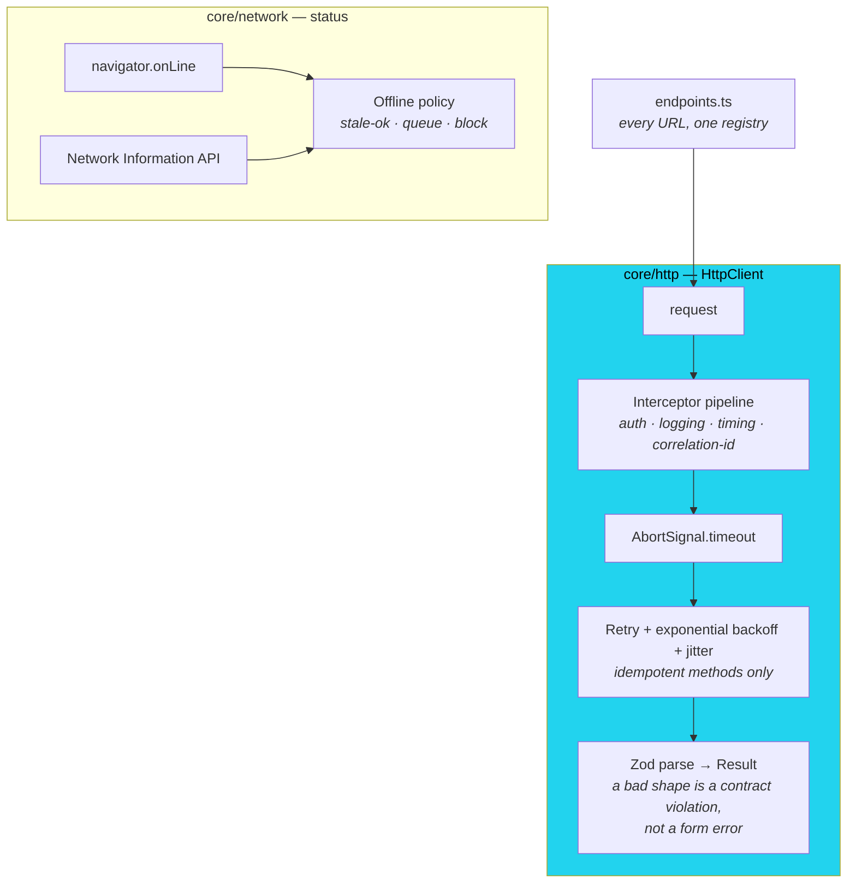

**Request/response only.** No WebSockets, no SSE, no subscriptions — a hard product constraint,
encoded structurally: no port anywhere accepts a callback that fires more than once, and
`connect-src` is `'self'` so an application socket would be blocked by the browser. Freshness is
a cache concern, not a transport one. [ADR 0012](adr/0012-no-realtime-transports.md).

Retries apply only to idempotent methods. Retrying a POST because it timed out is how one
charge becomes three.

---

## 16. Feature module anatomy

`features/document-analysis` is the reference implementation — every rule in this document is
exercised by it at least once. Copy its shape; the step-by-step is in
[FEATURE_TEMPLATE.md](FEATURE_TEMPLATE.md).

```
document-analysis/
├── domain/
│   ├── document.ts        Entity + value objects. Imports NOTHING.
│   ├── risk.ts            Scoring rules — pure, unit-tested in isolation
│   └── ports.ts           DocumentAnalysisRepository — what the app needs
├── application/
│   ├── analyze-document.ts        Use case: validate → analyze → persist
│   ├── get-document-analysis.ts   Use case: read with ownership check
│   └── dto.ts                     Entity → DTO. The taint boundary.
├── infrastructure/
│   ├── document-analysis-repository.ts   Implements the port
│   ├── fake-analysis-data-source.ts      The only shipped adapter
│   └── heuristic-analyzer.ts             Swappable for a model call
├── presentation/
│   ├── actions.ts          'use server' — wrapped by action()
│   ├── analysis-form.tsx   The one client component
│   └── analysis-report.tsx / risk-flag-card.tsx
├── validation/  constants.ts  tokens.ts
├── module.ts               registerDocumentAnalysis(container)
└── index.ts                Public API — nothing else is importable
```

The public API in `index.ts` is not a formality. It is the reason another team can own this
folder: everything not exported there can be changed without consulting anyone, and everything
exported there is a promise. An earlier version of this file omitted two types the outside
world needed — caught by a test that imports the module the way a consumer would.

---

## 17. Scaling to 500 screens

| Pressure | Answer |
|---|---|
| **500+ routes** | Route groups by area; features stay flat under `features/`. Nothing in the structure changes with count — no file needs editing when a feature is added except that feature's `module.ts` registration. |
| **Multiple teams** | One team owns a feature folder. The lint zones mean a cross-team dependency cannot be created accidentally — it has to go through a public API, which is a conversation, which is the point. |
| **White-labeling** | `config/tenant.ts` overrides design tokens and copy. Because every value lives in `tokens.css` and every string in a dictionary, a tenant re-skins the product without a code change. |
| **i18n** | `core/i18n` is wired end to end today: keys in schemas, resolution at the action boundary, `Intl.PluralRules` for plurals, RTL from locale metadata. A `[locale]` segment is the only remaining step. |
| **Swapping a provider** | Write an adapter, pass the port's contract suite, change one line in `bootstrap.ts`. Verified by a DI swap test rather than asserted. |
| **Onboarding** | Every folder has a README stating its purpose and its import rules; every non-obvious decision has an ADR naming the alternatives it beat. |

---

## Verification

What proves the above is true rather than aspirational:

```bash
npm run verify          # typecheck + lint + test + build
npm run test            # 347 unit, contract and component tests
npx playwright test     # E2E through the production build
```

- **Boundary rules fire:** add `import '@/features/document-analysis/infrastructure'` to a page
  and `npm run lint` fails.
- **Adapters really are swappable:** every port has a contract suite in `src/test/contracts/`,
  run against every adapter of that port.
- **The proxy is not load-bearing for auth:** an E2E test forges a session cookie and asserts
  the request reaches the route and fails there.
- **The theme does not flash:** an E2E test asserts the bootstrap script is inline, in `<head>`,
  and carries neither `src` nor `defer`.
